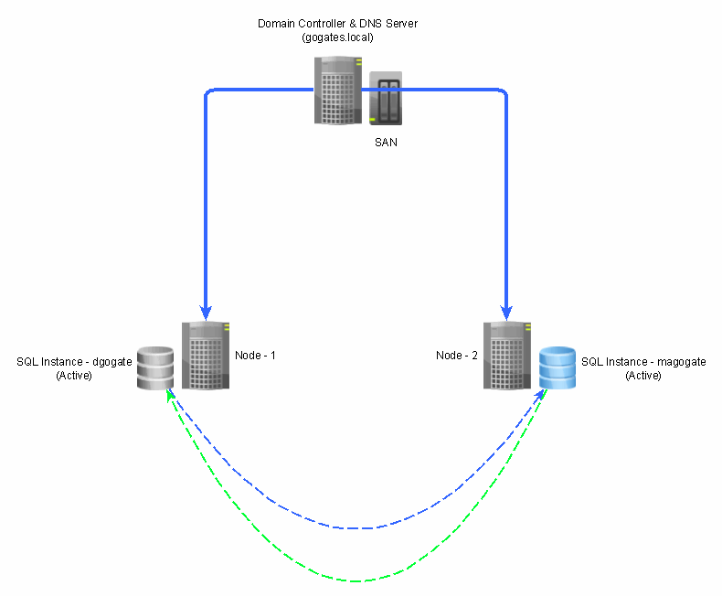

# SQL-2019-Active-Active-Cluster
## Videos
1. SQL Server 2019 Cluster - 1 : Installation of Win Server 2019 https://youtu.be/xJ_WJ_p0qjk
2. SQL Server 2019 Cluster - 2 : Configuring Active Directory Domain Controller https://youtu.be/oWJPw8WTW9c
3. SQL Server 2019 Cluster - 3 : Configuring of Node1 & Node2 https://youtu.be/LYLVX24hPg8
4. SQL Server 2019 Cluster - 4 : Adding nodes to Domain https://youtu.be/x54OX4iRjdg
5. SQL Server 2019 Cluster - 5 : Installation of iScassi Target https://youtu.be/0JyKAa58zsk
6. SQL Server 2019 Cluster - 6 : Creating Shared Storage Drives https://youtu.be/bYOgJdZEHns
7. SQL Server 2019 Cluster - 7 : Configuring Shared Drives on other nodes https://youtu.be/wvnI9Hk1lHM
8. SQL Server 2019 Cluster - 8 : Installing fail-over cluster feature https://youtu.be/IFT9SbSEM9g
9. SQL Server 2019 Cluster - 9 : Configuring Windows Server Failover Cluster https://youtu.be/kbZJg_LvOsE
10. SQL Server 2019 Cluster - 10 : Creating Service Accounts and Local Admins https://youtu.be/XQblyu-wgWc
11. SQL Server 2019 Cluster - 11 : Configuring Roles & CSVFS for LUNs https://youtu.be/o0UbJ0gpKP8
12. SQL Server 2019 Cluster - 12 : Disk Speed Check using Crystal Disk https://youtu.be/J_HFSEivNGc
13. SQL Server 2019 Cluster - 13 : Incensing & Downloading SQL Server 2019 https://youtu.be/wSVSmHa-v7E
14. SQL Server 2019 Cluster - 14 : Installing SQL Server 2019 Cluster on Node1 https://youtu.be/QUaSwMJS1DI
15. SQL Server 2019 Cluster - 15 : Installing SSMS and validate connectivity https://youtu.be/_VjDnhbzheI
16. SQL Server 2019 Cluster - 16 : Adding a node to SQL Server Failover Cluster https://youtu.be/iKKNrrFbnzA
17. SQL Server 2019 Cluster - 17 : Validating SQL Server Failover Cluster https://youtu.be/XR5ti7Ex3v8
18. SQL Server 2019 Cluster - 18 : Configuring TempDB on local SSD instead of Shared Drive https://youtu.be/C3FGi3eS5pI
19. SQL Server 2019 Cluster - 19 : Installing SQL Server 2019 Named Instance on Node2 https://youtu.be/qH3KxLXRqRQ
20. SQL Server 2019 Cluster - 20 : Adding a node to SQL Server Failover Cluster https://youtu.be/bZnYEG1zEBY

### How to configure SQL Server 2019 Active / Active Cluster on Windows Server 2019 Cluster

# Intruduction
In this video series we are going to see how to configure SQL Server 2019 Active / Active Cluster. Following are the pre-requisit for that

## Softwares needed
1. Windows Server 2019 Evaluation Edition, which you can download from 
    https://www.microsoft.com/en-us/evalcenter/evaluate-windows-server-2019
2. Vritualization Software - You can download VMWare Workstattion for free from following link for non-prod environment 
    https://www.vmware.com/products/workstation-pro/workstation-pro-evaluation.html

# Configuring Windows Server Cluster
Very first step in configuring SQL Server 2019 cluster is to have Windows Cluster first. Now there are many steps involved while creating Windows Cluster itself. Following are the steps which you can follow in-order to configure Windows Server Cluster

## 1. Installation of Windows Server 2019 Server
1. Install Windows Server 2019 by creating a Virtual Machine
2. Change machine name 
3. Allocate IP Address 
   #### Computer Name 
        1. This PC --> Properties --> Advanced System Settings --> Computer Name (gogate-dc-1)
   #### IP Addresses
        1. Control Panel --> Network & Internet --> Network and Sharing Center --> Ethernet0 --> Properties --> Internet Protocol Verstion 4 --> (TCP/IPv4)
           - Static IP Address : 192.168.80.10 (https://www.paessler.com/it-explained/ip-address) & (https://www.rapidtables.com/convert/number/binary-to-decimal.html)
           - Subnet Mask : 255.255.255.0 (https://www.paessler.com/it-explained/ip-address)
           - Default Gateway : 192.168.80.2 [Same for all VMs] (https://en.wikipedia.org/wiki/Default_gateway)
           - Preferred DNS Server : 192.168.80.10 [Same for all VMs] (https://www.cloudflare.com/learning/dns/what-is-a-dns-server/)
           - Alternet DNS Server : 192.168.80.2 
   #### Disable Firewall
        1. Control Panel --> System and Security --> Windows Defender Firewall --> Turn Off Windows Defender Firewall
## 2. Domain Controller Configurations   
### Installation of Active Directory
    1. Open Server Manager
    2. Local Server --> Manage --> Add Roles & Features
    3. Installation Type --> Role Based Installation
    4. Select local server - this is a default option
    5. Server Roles --> Select - Active Directory Domain Services 
    6. Install
### Configuring Active Directory Domain Service
    1. Click on AD-DS Role at Server Manager
    2. Click More
    3. Select Action - Promote server to domain controller
    4. Add a new forest (Since we don't have any existing domain)
    5. Give domain name as - gogates.local [you can give any name which you want eg. abc.xyz.pqr]
    6. Click Next
    7. Specify DSRM (directory service recovery mode) password
    8. No need to create DNS deligation
    9. NetBIOS domain name -- keep it default (it will appear as gogates as we had mentioned domain as gogates.local)
    10. Paths - Keep it default
    11. Install
    12. Restart & Login with Doamin User this time
### Validating Active Directory 
    1. Open "Active Directory Users and Computers"

## 3. Installation of 2 Nodes
### Installation of node-1
1. Install Windows Server 2019 by creating a Virtual Machine
2. Change machine name 
3. Allocate IP Address
   #### Computer Name 
        1. This PC --> Properties --> Advanced System Settings --> Computer Name (gogate-node-1)
   #### IP Addresses
        1. Control Panel --> Network & Internet --> Network and Sharing Center --> Ethernet0 --> Properties --> Internet Protocol Verstion 4 --> (TCP/IPv4)
           - Static IP Address : 192.168.80.15 (https://www.paessler.com/it-explained/ip-address) & (https://www.rapidtables.com/convert/number/binary-to-decimal.html)
           - Subnet Mask : 255.255.255.0 (https://www.paessler.com/it-explained/ip-address)
           - Default Gateway : 192.168.80.2 [Same for all VMs] (https://en.wikipedia.org/wiki/Default_gateway)
           - Preferred DNS Server : 192.168.80.10 [Same for all VMs] (https://www.cloudflare.com/learning/dns/what-is-a-dns-server/)
           - Alternet DNS Server : Keep blank 
   #### Disable Firewall
        1. Control Panel --> System and Security --> Windows Defender Firewall --> Turn Off Windows Defender Firewall
 ### Installation of node-2
1. Install Windows Server 2019 by creating a Virtual Machine
2. Change machine name 
3. Allocate IP Address
   #### Computer Name 
        1. This PC --> Properties --> Advanced System Settings --> Computer Name (gogate-node-2)
   #### IP Addresses
        1. Control Panel --> Network & Internet --> Network and Sharing Center --> Ethernet0 --> Properties --> Internet Protocol Verstion 4 --> (TCP/IPv4)
           - Static IP Address : 192.168.80.20 (https://www.paessler.com/it-explained/ip-address) & (https://www.rapidtables.com/convert/number/binary-to-decimal.html)
           - Subnet Mask : 255.255.255.0 (https://www.paessler.com/it-explained/ip-address)
           - Default Gateway : 192.168.80.2 [Same for all VMs] (https://en.wikipedia.org/wiki/Default_gateway)
           - Preferred DNS Server : 192.168.80.10 [Same for all VMs] (https://www.cloudflare.com/learning/dns/what-is-a-dns-server/)
           - Alternet DNS Server : Keep blank
   #### Disable Firewall
        1. Control Panel --> System and Security --> Windows Defender Firewall --> Turn Off Windows Defender Firewall

## 4. Adding nodes to Domain
1. Validate if you can ping to Domain from both the nodes - ping gogates.local
2. Assign domain name for both nodes 
   - This PC --> Properties --> Advanced System Settings --> Member Of Domain - gogates.local
   - Specify credentials for Domain Admin - gogates\Administrator & P@ssword#123
   - Restart server
   - Follow same steps for both nodes
   - While logging you should be able to login as Domain Administrator user instead of local Administrator
   - Validate nodes in Domain Controller using "Active Directory Users and Computers"

## 5. Installation of iScassi Target
As mentioned in very first video and also in image, DC Server / Node will also act as Storage or SAN. We will create 6 drives there as below
1. 2 Data Drives (5 GB Each) - Data01 (G) & Data02 (H)
2. 2 Log Drives (3 GB Each) - Log01 (L) & Log02 (M)
3. 2 Temp Drives (2 GB Each) - Temp01 (T) & Temp02 (U)
4. Quorum Drive (1 GB)

These drives will share with other nodes, wherein we will actually install & configure SQL Server 2019 Active \ Active Cluster.

Now, in order to create & share \ present these drives (iscasi luns) to other nodes, we need to follow following steps
### a. Installation of iSCSI Target Server
        1. Open Server Manager
        2. Local Server --> Manage --> Add Roles & Features
        3. Installation Type --> Role Based Installation
        4. Select local server - this is a default option
        5. Server Roles --> Select - File & Storage Services --> iSCSI Target Server
        6. Install        
### b. Add NIC Cards to all 3 nodes in network for iSCSI communication
        1. Player --> Manage --> Virtual Machine Settings 
        2. Click Add --> Select Network Adapter
        3. Assign static IP Address for all 3 nodes as below
           - for DC             -- 10.0.0.10
           - for gogate-node-1  -- 10.0.0.15
           - for gogate-node-2  -- 10.0.0.20
        4. Disable Windows Firewall
        5. Check the connectivity from DC
    
### c. Creating Shared Disks on Domain Controller
        1. Open Server Manager
        2. Select "File & Storage Services"
        3. Select "iSCSI"
        4. Tasks --> "New iSCSI Virtual Disk"
        5. Specify Disk Name
        6. Specify Disk Size
        7. Add Target IP Address 10.0.0.15 & 10.0.0.20
        8. Repeat process for all drives which needs to be added

### d. Configuring Shared Drives on gogate-node-1 & gogate-node-2
        1. Open "iSCSI initiator"
        2. Specify target - 10.0.0.10
        3. Click on Volumes & Devices --> Auto Configure
        4. To format disk - Open "Disk Management"
        5. Select disks and make online (Right click on each disk)
        6. Once its online -- right click --> Initialize Disk
        7. Select "GPT - GUID Partition Table" --> 
        8. Click on Drive (once its online) & click "New Simple Volume"
        9. Specify Drive Letter
        10. Specify following settings
           - File System - NTFS
           - Allocation Unit Size -- 64 KB (https://blog.sqlserveronline.com/2017/12/08/sql-server-64kb-allocation-unit-size/)
           - Volume Label
           - Select "Perform Quick Format"
           - Finish
        11. Repeat same for all available drives
        12. Once node-1 configuration is finished, make all drives offline
        13. Open "iSCSI Initiator" on 2nd node
        14. Specify target - 10.0.0.10
        15. Click on Volumes & Devices --> Auto Configure
        16. Open "Disk Management"
        17. Select disks and make online (Right click on each disk)
        18. Right click on each drive --> Select "Change Drive Letter" & match it exactly what we had given for Node1

## 6. Installing & Configuring Windows Server 2019 Cluster
As we discussed in very first video, in order to configure SQL Server 2019 Cluster we should first have Windows Server 2019 cluster. This Windows Cluster 2019 will be between gogate-node-1 & gogate-node-2, as Domain Controller node is not required now.
### a. Add new Network Adapter Cards
    1. First step of this process is to add 2 separate NIC Cards to each node
    2. Assign IP Address to each of them as below
       - gogate-node-1 - 172.16.0.15
       - gogate-node-2 - 172.16.0.20
    3. Disable Firewall
    4. Restart both nodes
### b. Install fail-over cluster feature on both nodes
    1. Open Server Manager
    2. Local Server --> Manage --> Add Roles & Features
    3. Features --> Select "Failover Clustering"
    4. Click "Add Features"
    5. Install
    6. Restart the machine
    7. Do it for both the nodes
### c. Configure Windows Cluster
    1. Open "Failover Cluster Manager"
    2. Select "Create Cluster"
    3. Add both nodes gogate-node-1 & gogate-node-2
    4. Perform validation by selecting all required tests
    5. Validate the report and check the status 
    6. Specify cluser name - WinServerCluster
    7. Specify IP Address - 192.168.80.25
    8. Select "Add all eligible storege to cluster"
    9. Click Finish
### d. Validate witness / quorum disk
    1. Right click on "WinServerCluster" --> More Actions --> Configure Cluster Quorum Settings
    2. Next --> select quorum witness
    3. Configure a disk witness
    4. Select witness disk (Q) from available disk
### e. Validate Cluster Failover    

## 7. SQL Server 2019 Installation - Prerequisite

### a. Creating Service Accounts
    1. Open "Active Directory Users and Computers"
    2. Create AD Group "SQL PRD ADMIN" for all Admins, and give Domain Admin or Local Admin access to this group.
    3. Add individual Domain Accounts to "SQL PROD ADMIN". e.g. Add gogates\magogate or gogates\dgogate to group "SQL PRD ADMIN"
    4. Make AD Group "SQL PRD ADMIN" as a Local Admin to each node
       - Open "Edit Local Users and Groups"
       - Under Groups section, select "Administrator" group and add "SQL PRD ADMIN" in it.
    5. Create separate Service Accounts for each SQL Service as below
       - SQL.PRD.SERVER
       - SQL.PRD.AGENT   
       
### b. Grant Windows Rights to SQL Server Service account
    1. Open "Local Group Policy Editor"
    2. Add above listed SA accounts to following listing - https://www.sqlshack.com/perform-volume-maintenance-tasks-security-policy/
       - Perform volume maintenance tasks
       - Lock pages in memory

### c. Benchmarking LUNs or Speed Checks of Shared Drives
    1. Download & Install "Crystal Disk" software from https://osdn.net/projects/crystaldiskmark/downloads/71859/CrystalDiskMark7_0_0h.exe/
    2. How to read "Crystal Disk" results - https://www.brentozar.com/archive/2012/03/how-fast-your-san-or-how-slow/
    3. Use Microsoft DiskSpd from - https://docs.microsoft.com/en-us/azure-stack/hci/manage/diskspd-overview

### d. Changing to CSVFS (Cluster Shared Volume File System) format
    1. Sharing Disks between 2 nodes
       - Open Administrative Tools --> Failover Cluster Manager
       - Create 2 Empty Roles - Node1 & Node2
       - Assign Preferred Owner as Node1, Node2 & vice versa       
       - Assign Storage to each node
    3. or instead use CSVFS - Why its needed?
    4. More information on https://docs.microsoft.com/en-us/windows-server/failover-clustering/failover-cluster-csvs

## 8. SQL Server 2019 Installation 
1. SQL Server Editions & Licencing 
    https://download.microsoft.com/download/6/6/0/66078040-86d8-4f6e-b0c5-e9919bbcb537/SQL%20Server%202019%20Licensing%20guide.pdf  
    You can validate the cores by
    1. Control Panel\System and Security\System and check Processors
    2. Or Open task manager --> Open Resoure Monitor --> Click on CPU
    3. Or Advanced System Settings --> Hardware --> Device Manager --> Processors
2. Download SQL Server Developer Edition from https://www.microsoft.com/en-us/sql-server/sql-server-downloads
    1. Once download, run the installer and choose "Download Media" option
    2. Select following options on next screen
       - Choose ISO image for download
       - Location as G:\Softwares\SQLServer2019
       - Click download
    3. Once download finishes, copy ISO image to respective node where you want to install SQL Server
    4. Click on ISO, and you can start SQL Server Installation by running Setup.exe
3. Installation Steps
    1. Create directories as below
       - C:\ClusterStorage\Volume1\MSSQL\Data01
       - C:\ClusterStorage\Volume2\MSSQL\Data02
       - C:\ClusterStorage\Volume3\MSSQL\Log01
       - C:\ClusterStorage\Volume4\MSSQL\Log02
       - C:\ClusterStorage\Volume5\MSSQL\Temp01
       - C:\ClusterStorage\Volume6\MSSQL\Temp02
    2. Re-Name Network 
       - Cluster Network 1 --> Cluster Nodes
       - Cluster Network 2 --> Shared Drives
       - Cluster Network 3 --> Heartbeat [This will verify if both nodes are up & running; if one of the node is down, it will start failover]
    3. Choose "Installation" --> "New SQL Server Failover Cluster Installation"
    4. Specify Edition --> (Developer)
    6. Accept Lincese Aggregement
    7. Feature Selection - We are going to install only "Database Engine Service".
    8. Select installation directories as follows
       - Instance Root Directory - C:\Program Files\Microsoft SQL Server\
       - Shared Feature Directory - C:\Program Files\Microsoft SQL Server\
       - Shared Feature Directory (x86) - C:\Program Files (x86)\Microsoft SQL Server\
    9. Specify SQL Server Network Name - dgogate 
    10. This will be used to connect to SQL Server, you can skip named instance and keep default instance
    11. Specify Disks which you want to allocate to that SQL Server instance. In our case Disk 1,3,5 are for first instance & Disk 2,4,6 are for second instance
    12. Specify IP Address for SQL failover cluster - this has to be of same range \ network of your node - which is 192.168.80.30
    13. Specify Service Accounts & Change startup type to Automatic
       - SQL Server Agent - SQL.PRD.AGENT & Specify Password
       - SQL Server Database Engine - SQL.PRD.SERVER & Specify Password
       - Select "Grant Perform Volume Maintenance Tasks privileges to SQL Server Database Engine Services"
    14. Select "Mixed Mode" Authentication
       - Specify password for SA account as "P@ssword#123"
       - Add group "SQL PRD ADMIN" as SQL Administrator
    15. Specify Data Directories     
       - Select data root directory as "C:\ClusterStorage\Volume1\MSSQL\Data01"
       - Select User database directory as "C:\ClusterStorage\Volume1\MSSQL\Data01\MSSQL15.DGOGATE\MSSQL\Data"
       - Select User database log directory as "C:\ClusterStorage\Volume3\MSSQL\Log01\MSSQL15.DGOGATE\MSSQL\Data"
    16. Temp DB
        - As per microsoft documentation "The number of secondary data files depends on the number of (logical) processors on the machine. As a general rule, if the number of logical processors is less than or equal to eight, use the same number of data files as logical processors. If the number of logical processors is greater than eight, use eight data files. Then if contention continues, increase the number of data files by multiples of four until the contention decreases to acceptable levels, or make changes to the workload/code." which is available as below
        - https://docs.microsoft.com/en-us/sql/relational-databases/databases/tempdb-database?view=sql-server-ver15
        - Since in our case - logical processors are 2, SQL installer intelligently took "No. of Files" as 2        
        - What Size you would select? check that at https://www.brentozar.com/archive/2016/01/cheat-sheet-how-to-configure-tempdb-for-microsoft-sql-server/
        - Since we are going to have 3 GB of Temp drive for each node, select "Initial Size (MB)" as 1 GB (1024 MB)
        - Select data directory as - C:\ClusterStorage\Volume5\MSSQL\Temp01
        - Select log directory as - C:\ClusterStorage\Volume5\MSSQL\Temp01
        - Keep "Temp log file Size configuration" as default
    17. MaxDOP
        - Total no of logical processors we have are 2 so based on that it got selected as 2 by default. Please see documentation as below
        - https://www.mssqltips.com/sqlservertip/6211/sql-server-2019-installation-enhancements-for-maxdop-and-max-memory/
    18. Memory
        - Click on "Recommended"
        - Since we have total 2 GB avilable for VM, change max memory to 1024 MB / 1 GB
        - Select "Click here to accept the recommended memory configurations for the SQL Server Database Engine"
        - More information is available at https://www.mssqltips.com/sqlservertip/6211/sql-server-2019-installation-enhancements-for-maxdop-and-max-memory/
    19. FileStream
        - This is required if you are going to use un-structured data. we will ignore this
        - https://docs.microsoft.com/en-us/sql/relational-databases/blob/filestream-sql-server?view=sql-server-ver15
    20. Click Next & the Install
    21. Installation will fail with error as below if you specify Temp directory directly as C:\ClusterStorage\Volume3. So, make sure you will create directory inside a drive before installation
        "Updating permission settings for folder "C:\ClusterStorage\Volume3" failed. Please check blog - https://blog.sqlauthority.com/2017/11/11/sql-server-installation-error-updating-permission-setting-file-failed/
    17. Cancel installation, create a new directory under Volume3 and re-start installation
       
4. Download SSMS from https://docs.microsoft.com/en-us/sql/ssms/download-sql-server-management-studio-ssms?view=sql-server-ver15    

5. Installing failover cluster
    1. Copy installer to 2nd node
    2. Choose "Installation" --> "Add a node to a SQL Server Failover Cluster"
    3. Select "Developer" Edition
    4. Accept "License Aggregement"
    5. All validations should be Ok
    6. Specify SQL Server Instance - in our case its a default instance, name of node2, Cluster Network Name (dgogate) & name of node1. This is all default and no need to modify anything here.
    7. IP Address of SQL Instance will appear automatically
    8. SQL Server & Agent Services and corresponding Service Accounts will appear; specify password. Select check box for volume maintenance task
    9. Install
    
5. Validation of SQL Server failover cluster
    1. Validate the ownership of LUNs / Disks - its not mandatory    
    2. Create a Dummy database and create a table in that. Run a sql query to validate the data
    3. Turn off one node
    4. You should still be able to connect to SQL Server from 2nd node and execute same query

6. Use Local SSD instead of Shared Drives / SAN for TempDB
    1.  Create directories under C:\MSSQL\Temp01
    2.  Move existing TempDB from Shared Drive to Local Drive
        - How to move DBs from one drive to another? https://docs.microsoft.com/en-us/sql/relational-databases/databases/move-system-databases?view=sql-server-ver15
    2.  Bring one of the node and validate
