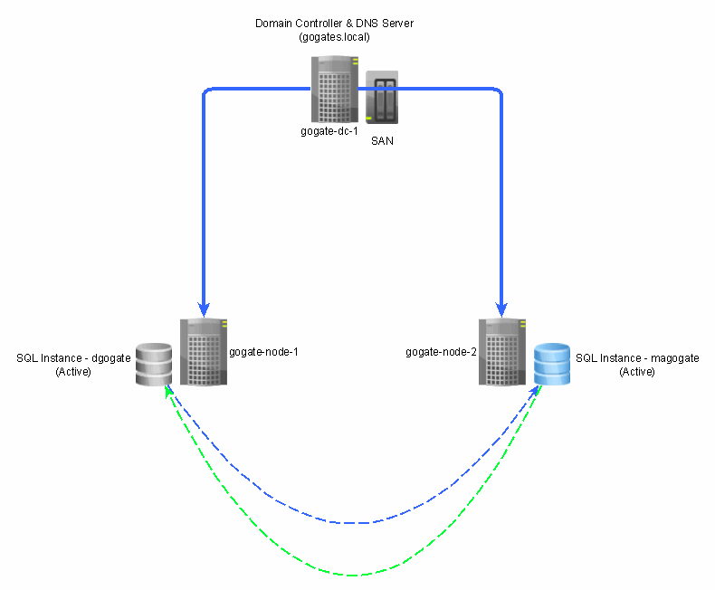

# SQL-2019-Active-Active-Cluster
### How to configure SQL Server 2019 Active / Active Cluster on Windows 2019 Server Cluster

# Intruduction
In this video series we are going to see how to configure SQL Server 2019 Active / Active Cluster. Following are the pre-requisit for that

## Softwares needed
1. Windows Server 2019 Evaluation Edition, which you can download from 
    https://www.microsoft.com/en-us/evalcenter/evaluate-windows-server-2019
2. Vritualization Software - You can download VMWare Workstattion for free from following link for non-prod environment 
    https://www.vmware.com/products/workstation-pro/workstation-pro-evaluation.html

# Configuring Windows Server Cluster
Very first step in configuring SQL Server 2019 cluster is to have Windows Cluster first. Now there are many steps involved while creating Windows Cluster itself. Following are the steps which you can follow in-order to configure Windows Server Cluster

## 1. Configuring Domain Controller 
1. Install Windows Server 2019 by creating a Virtual Machine
2. Change machine name to
3. Allocate 
   - IP Address 
       --> This PC --> Properties --> Advanced System Settings --> Computer Name
   - DNS Name
   -   --> Control Panel --> Network & Internet --> Network and Sharing Center --> Ethernet --> Properties
   - 
